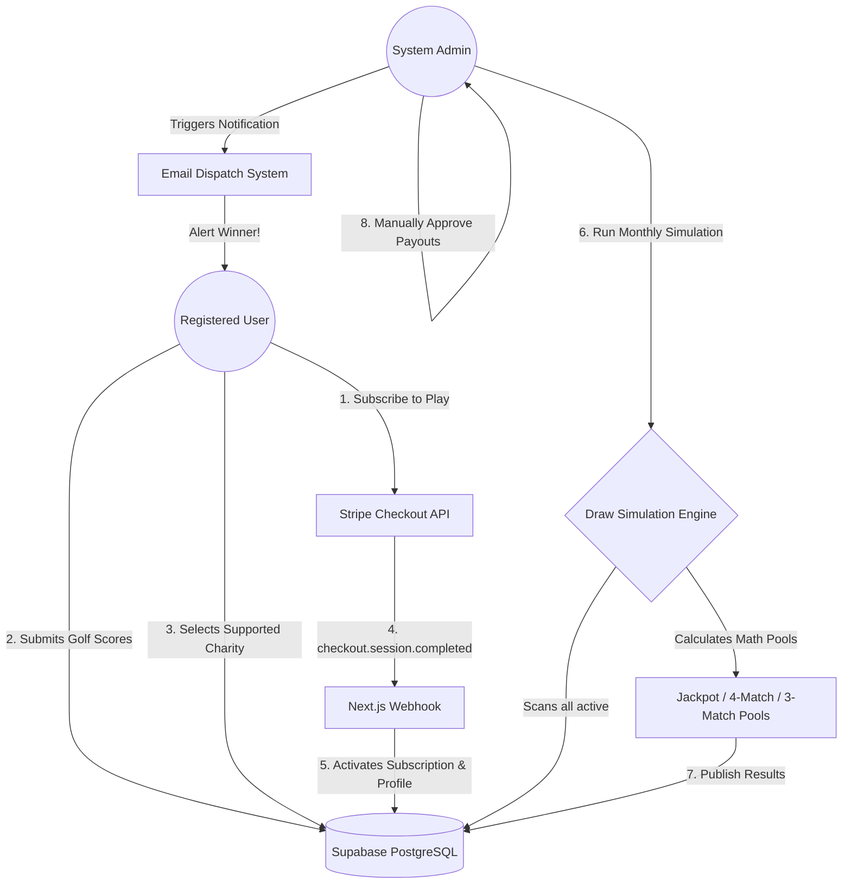

# Par4Charity — Golf Subscription & Draw Platform ⛳💚

**Developed for the Digital Heroes Selection Process**

Par4Charity is a production-ready, full-stack SaaS platform combining automatic golf performance tracking, algorithmic monthly prize pools, and charitable integrations. It operates on a modern, emotionally resonant UI/UX entirely removed from traditional golf aesthetics, maintaining a focus on impact.

---

## 🏗️ Architecture & Stack
- **Framework:** Next.js 14 (App Router) with React Server Components (RSC)
- **Database:** Supabase PostgreSQL with rigorous Row Level Security (RLS) and custom triggers
- **Payments:** Stripe Checkout & Webhook Pipeline
- **Styling:** Custom Modular CSS with Native Light/Dark Mode 🌓

---

## 🚀 Architecture Data Flow

## 🧠 Key Technical Highlights (PRD Fulfillment)

### 1. The Rolling 5-Score Algorithm
A complex PostgreSQL Database Trigger (`enforce_score_limit`) mathematically limits every user to exactly 5 active scores. The moment a 6th score is submitted, the trigger strictly identifies and purges the oldest chronological record, automating the rolling window entirely at the data layer instead of risking client-side desync.

### 2. Algorithmic Prize Pool Mathematical Engine
The Draw system doesn't just guess numbers. It uses a custom Node.js simulation engine capable of calculating:
- **Random Mode:** Pure lottery style 1-in-1.2-million scaling.
- **Algorithmic Mode:** Scans the active datastore of all players and dynamically biases the winning output to align with the most frequently entered scores.
- **Dynamic Jackpot Rollovers:** Automatically pulls 40% / 35% / 25% distribution brackets from Stripe payload accumulations, and triggers subsequent jackpots if no 5-match is found.

### 3. Server-Side Security Middleware
Client-side hydration checks are insufficient. We implemented a strict `@supabase/ssr` Edge Middleware file that physically intercepts incoming network requests, preventing unauthorized users—or users manipulating local cache—from viewing the Dashboard or Admin interfaces.

---

## 🧪 Evaluator Testing Guide (How to QA)

Because this platform relies on complex probability mathematics, you will need to intentionally force certain states to test them. Use the following guide:

### Core Subscription Workflow
1. Navigate to `/subscribe` and sign up for either a Monthly or Yearly plan.
2. Complete the Stripe sandbox checkout (Use test card: `4242 4242 4242 4242`).
3. You will be redirected to the dashboard, and a background Webhook automatically validates your subscription status and initializes your charity donation bracket.

### How to Test the Winnings / Draw Payout Engine
If you use **"Random Mode"** with only 1 database user, the probability of hitting a 5-Match is 1 in 1,221,759. You will realistically log 0 winners and trigger a Jackpot Rollover. **To force a winner and test the payout module:**

1. Navigate to your User Dashboard and enter exactly **5 random scores** (e.g., `12, 14, 28, 32, 41`).
2. Log into the global **Admin Panel**.
3. Go to **Draw Management**. Enter the *exact* same 5 numbers you submitted in your user dashboard as the manual simulation query.
4. Click **Run Simulation**. You will immediately hit a 5-Match Jackpot for yourself!
5. Click **Publish Results**.
6. Navigate back to your User Dashboard and check the **Winnings Tab**. The platform will congratulate you for winning and ask you to upload a scorecard proof.
7. Upload proof. Return to the Admin panel, go to **Winners**, approve your own proof, and mark the status as "Paid".

### Testing Dark Mode
Click the `🌓` toggle button located on the top navigation bar or the bottom of the User/Admin sidebars to swap between the global light and dark themes—state persists locally. 
