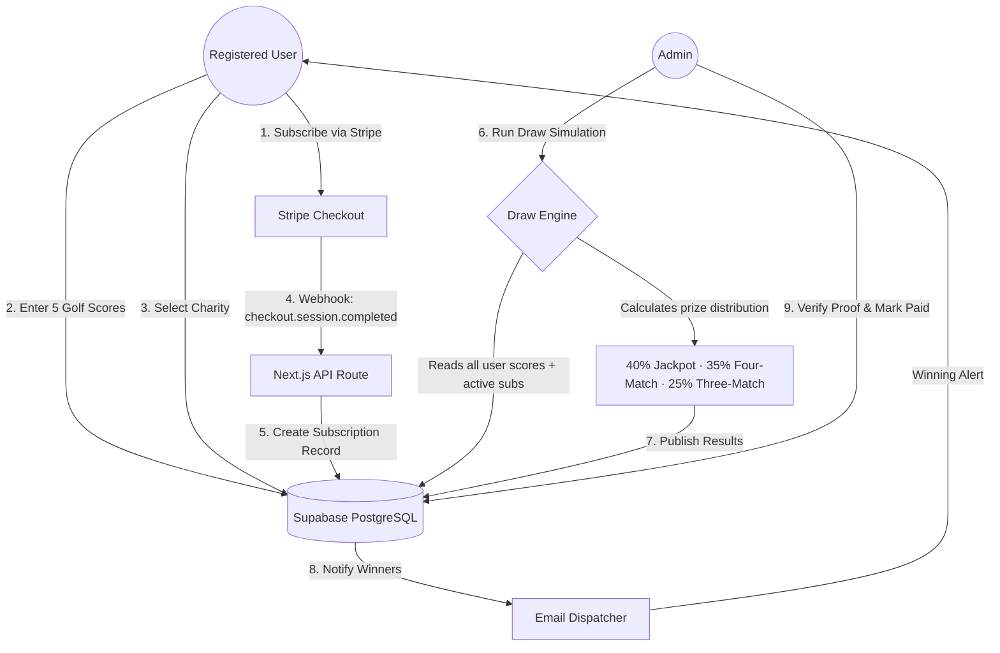

# Par4Charity ⛳💚
### Golf Subscription & Charity Draw Platform
**Developed for the Digital Heroes Selection Process · Full-Stack Trainee Assignment**
        
> A production-ready SaaS platform that combines golf score tracking, algorithmic monthly prize draws, and charitable giving — built on Next.js 14, Supabase, and Stripe.
 
---
 
## 🔗 Live Links

| Resource | URL |
|---|---|
| 🌐 Live Platform | https://par4charity.vercel.app |
| 👤 User Dashboard | https://par4charity.vercel.app/dashboard |
| 🔐 Admin Panel | https://par4charity.vercel.app/admin |
| 📂 GitHub Repo | https://github.com/Kalpavruksha/par4charity |

---

## 🔐 Test Credentials

| Role | Email | Password | Access |
|---|---|---|---|
| **Admin** | `admin@gmail.com` | *(provided in form)* | Full Admin Panel + User Dashboard |
| **Test User** | Sign up fresh at `/auth/signup` | Your choice | User Dashboard only |

> 💡 The Admin account also has a full user profile, so you can test both the Admin Panel AND the User Dashboard with the same login.

---

## 🏗️ Architecture Overview



---

## 🧠 Tech Stack

| Layer | Technology |
|---|---|
| **Framework** | Next.js 14 (App Router + React Server Components) |
| **Database** | Supabase PostgreSQL with Row Level Security (RLS) |
| **Auth** | Supabase Auth + `@supabase/ssr` Edge Middleware |
| **Payments** | Stripe Checkout + Webhooks |
| **Email** | Resend API (dry-run mode in demo) |
| **Hosting** | Vercel (CI/CD from GitHub main branch) |
| **Styling** | Custom CSS with native Light/Dark Mode |

---

## 🧪 Complete Testing Guide

### ─────────────────────────────────────
### 👤 PART 1: USER FLOW (Standard User)
### ─────────────────────────────────────

#### Step 1 — Sign Up
1. Go to https://par4charity.vercel.app/auth/signup
2. Enter your name, email, and password → click **Sign Up**
3. You will be redirected to the **User Dashboard**

---

#### Step 2 — Subscribe to a Plan
1. From the Dashboard, click **💳 Subscription** in the left sidebar
2. Or go to https://par4charity.vercel.app/subscribe
3. **Choose a plan:**
   - **Monthly** — £9.99/month
   - **Yearly** — £89.99/year (save 25%)
4. **Choose a charity** from the slider step (Golf Foundation, Macmillan, WWF, etc.)
5. Set your **charity contribution %** (10–50%)
6. Click **Proceed to Payment**
7. You land on **Stripe Checkout** — use test card:
   ```
   Card Number: 4242 4242 4242 4242
   Expiry: Any future date (e.g. 12/26)
   CVC: Any 3 digits
   ```
8. After payment, you are redirected back to your **Dashboard** with subscription active ✅

---

#### Step 3 — Enter Your Golf Scores
1. Click **⛳ My Scores** in the left sidebar
2. Enter a Stableford score between **1 and 45**
3. Select the **Date Played**
4. Optionally add Course Name and Notes
5. Click **Add Score**
6. **Repeat 5 times** to fill all 5 score slots
7. The score history panel shows all 5 scores with a rolling "Latest" badge
8. A green banner appears: *"✅ All 5 scores entered. You are eligible for this month's draw!"*

> **Rolling System:** Adding a 6th score automatically deletes the oldest one — enforced by a PostgreSQL database trigger (`enforce_score_limit`), not just client-side logic.
 
---

#### Step 4 — View Your Charity Contribution
1. Click **🌱 My Charity** in the sidebar
2. You can see which charity you selected, your monthly contribution amount, and total donated

---

#### Step 5 — Check Monthly Draws
1. Click **🎰 Draws** in the sidebar
2. View current and past draw results
3. After the Admin publishes a draw, winning numbers are displayed here

---

#### Step 6 — Check Winnings (After a Draw is Published)
1. Click **🏆 Winnings** in the sidebar
2. If you are a winner, your prize amount and match details are shown
3. Click **Upload Proof** — upload any image as your "scorecard"
4. Your status changes to `proof_submitted`
5. The Admin then verifies and marks you as "Paid"

---

#### Step 7 — View Profile & Account Settings
1. Click **👤 Profile** in the sidebar
2. Update your display name
3. Change your charity donation percentage

---

#### Step 8 — Toggle Dark Mode
- Click the **🌙 moon icon** in the top Navbar OR at the bottom of the left sidebar
- Page instantly switches between Light and Dark themes
- Your preference is saved to `localStorage` and persists on refresh

---

### ─────────────────────────────────────
### 🔐 PART 2: ADMIN FLOW (Admin Account)
### ─────────────────────────────────────

> Login with admin credentials, then go to: https://par4charity.vercel.app/admin

---

#### Admin Step 1 — Overview Dashboard
- See platform-wide stats: total users, active subscribers, total charity donated, prize pool totals
- Real-time numbers pulled from the live Supabase database

---

#### Admin Step 2 — User Management (`/admin/users`)
1. See a table of **all registered users**, their subscription plan, and status
2. Click any user row to **expand their score records**
3. You can **edit or delete** individual scores for any user
4. Toggle the **Admin** switch to promote or demote a user to Admin role

> The admin was set by toggling `is_admin = true` in their Supabase `profiles` table record.

---

#### Admin Step 3 — Running a Draw (`/admin/draws`) ⭐ Key Feature

This is the most important module to test:

**To run a simulation:**
1. Go to **Draw Management**
2. Select Draw Mode:
   - **Random** — 5 purely random numbers (1–45). Statistically unlikely to produce winners with 1 test user.
   - **Algorithmic** — Biased toward numbers that appear in user score history. More likely to create winners.
3. Click **🔄 Run Simulation**
4. The system generates 5 Winning Numbers and displays a preview of:
   - Jackpot (5-match) winner count
   - 4-match winner count
   - 3-match winner count
   - Prize pool breakdown

**To force a winner (recommended for testing):**
1. Note the 5 simulated winning numbers (e.g. `7, 11, 12, 31, 45`)
2. Go to User Dashboard → **My Scores**
3. Edit your scores so they include at least **3 of those 5 numbers**
4. Return to **Admin → Draw Management**
5. The simulation already saved those winning numbers — do NOT click Run Simulation again
6. Click **📢 Publish Results**
7. The system runs the match algorithm against ALL active users' scores
8. Winners are created in the database and email alerts are triggered

> ⚠️ Important: Always Publish the existing simulation — do not run another simulation first or new numbers will be generated.

---

#### Admin Step 4 — Verify Winners (`/admin/winners`)
1. After publishing a draw, go to **🏆 Winners**
2. See all winners with their match count, prize amount, and proof status
3. When a user uploads their scorecard, status changes to `proof_submitted`
4. Click **Approve** to verify the proof
5. Change **Payout Status** to `paid` once the user has been paid

---

#### Admin Step 5 — Charity Management (`/admin/charities`)
1. View all registered charity partners
2. Add new charities with name, description, category, and target
3. Edit or delete existing charities
4. Raised amount updates automatically from subscription webhook data

---

#### Admin Step 6 — Subscription Management (`/admin/subscriptions`)
1. See all active and cancelled subscriptions
2. View which user is on which plan and which charity they support

---

#### Admin Step 7 — Reports (`/admin/reports`)
1. View aggregated platform statistics:
   - Total revenue collected
   - Charity donations distributed
   - Draw history and winner records
   - Subscriber growth

---

## 🔒 Security Architecture

| Mechanism | Description |
|---|---|
| **Edge Middleware** | `middleware.ts` intercepts ALL requests to `/dashboard` and `/admin`. Unauthenticated users are immediately redirected to `/auth/login` — even if they paste the URL directly. |
| **Layout Server Checks** | `dashboard/layout.tsx` and `admin/layout.tsx` contain server-side session validation as a secondary barrier, preventing cached page access after logout. |
| **RLS Policies** | Every Supabase table has Row Level Security policies. Users can only read/write their own data. Admins use a `SECURITY DEFINER` function to bypass RLS safely. |
| **Webhook Validation** | The Stripe webhook route verifies the `stripe-signature` header cryptographically before processing any payment event. |

---

## 🌍 Scalability Notes (PRD Compliance)

| PRD Requirement | Implementation |
|---|---|
| Multi-country expansion | Stripe natively supports 135+ currencies. DB uses UTC timestamps and UUID primary keys. |
| Teams / Corporate accounts | Add `team_id` to `profiles` table — RLS policies extend naturally. No architecture change needed. |
| Campaign module | Add a `campaigns` table linked to `charities` via FK. Campaign draws would reuse the existing draw engine. |
| Mobile app support | Supabase REST API + Auth is framework-agnostic. React Native app can reuse the same DB, auth, and draw endpoints with zero backend changes. |

---

## 📁 Project Structure

```
par4charity/
├── app/
│   ├── page.tsx                  # Home page
│   ├── layout.tsx                # Root layout
│   ├── globals.css               # Full design system (light + dark mode)
│   ├── auth/
│   │   ├── login/page.tsx        # Login page
│   │   └── signup/page.tsx       # Signup page
│   ├── dashboard/
│   │   ├── layout.tsx            # Server-side auth guard
│   │   ├── page.tsx              # Overview with stat cards
│   │   ├── scores/page.tsx       # Rolling 5-score entry
│   │   ├── charity/page.tsx      # Charity contribution view
│   │   ├── draws/page.tsx        # Draw results browser
│   │   ├── winnings/page.tsx     # Prize claims + proof upload
│   │   ├── subscription/page.tsx # Plan management
│   │   └── profile/page.tsx      # Account settings
│   ├── admin/
│   │   ├── layout.tsx            # Server-side admin guard
│   │   ├── page.tsx              # Admin overview
│   │   ├── users/page.tsx        # User + score management
│   │   ├── draws/page.tsx        # Draw simulation + publish
│   │   ├── charities/page.tsx    # Charity CRUD
│   │   ├── winners/page.tsx      # Winner verification
│   │   ├── subscriptions/page.tsx
│   │   └── reports/page.tsx      # Platform analytics
│   ├── api/
│   │   └── stripe/
│   │       ├── create-checkout/route.ts  # Stripe session creator
│   │       └── webhook/route.ts          # Stripe event processor
│   ├── charities/
│   │   ├── page.tsx              # Searchable charity directory
│   │   └── [id]/page.tsx         # Individual charity profiles
│   ├── subscribe/page.tsx        # Multi-step subscription flow
│   ├── contact/page.tsx          # Contact form with email dispatch
│   ├── draws/page.tsx            # Public draw results
│   ├── how-it-works/page.tsx     # Platform explainer
│   ├── terms/page.tsx            # Terms of Service
│   ├── privacy/page.tsx          # Privacy Policy
│   └── draw-rules/page.tsx       # Official Draw Rules
├── components/
│   ├── Navbar.tsx                # Responsive nav + theme toggle
│   ├── Footer.tsx                # Site-wide footer
│   ├── DashboardSidebar.tsx      # Sidebar with tooltips
│   └── AdminSidebar.tsx          # Admin navigation
├── lib/
│   ├── draw-engine.ts            # Core prize draw algorithm
│   ├── stripe.ts                 # Stripe client + plan config
│   ├── email.ts                  # Resend email dispatcher
│   └── supabase/
│       ├── client.ts             # Browser Supabase client
│       └── server.ts             # Server Supabase client
├── middleware.ts                 # Route protection (Edge)
├── supabase/schema.sql           # Full DB schema + RLS + triggers
└── README.md                     # This file
```

---

*Built with ❤️ for the Digital Heroes selection process · digitalheroes.co.in*
